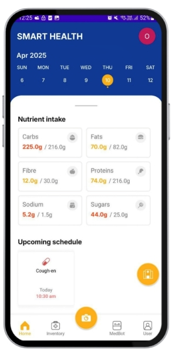
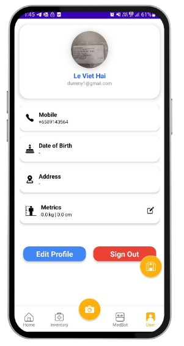

# Smart Health

  

    
    
    
  

  

  
Your all-in-one companion for smarter choices, healthier habits, and a better you.

  
<b>Track Smarter - Consult Faster - Recover Better</b>

## 📱 Introduction

### 💡 Impetus

In today’s fast-paced world, managing personal health can often take a back seat. With the abundance of health advice scattered across the internet and the inconvenience of manually tracking one’s diet, medication, and recovery, many users struggle to maintain consistent and effective healthcare routines.

Our project, **SMART HEALTH**, was inspired by this gap. We aim to empower users with an all-in-one mobile health management app that streamlines health tracking, provides personalized AI-driven suggestions, and connects users with nearby medical facilities—enabling a healthier and more sustainable lifestyle.

### ❓ Problem Statement

How might we provide **personalized health tracking** to help users manage their **diet, medication, and recovery** more effectively, while **reducing the inconvenience of typical health monitoring processes** and offering **reliable health advice**?

Introducing **Smart Health** – your personal health companion that tracks, advises, and guides you to better living!

## 👀 App Screenshots
<table>
  <tr>
    <td>
      

        
        
Register Page

      

    </td>
    <td>
      

        
        
Login Page

      

    </td>
    <td>
      

        
        
Landing Page

      

    </td>
  </tr>
  <tr>
    <td>
      

        
        
Calendar System (Landing Page)

      

    </td>
    <td>
      

        
        
Medicine Inventory Page

      

    </td>
    <td>
      

        
        
Smart Scan Page

      

    </td>
  </tr>
  <tr>
    <td>
      

        
        
Form Fill Page

      

    </td>
    <td>
      

        
        
Form Fill by History Page

      

    </td>
    <td>
        

            
            
Clinic Finder Page

        

    </td>
  </tr>
  <tr>
    <td>
      

        
        
BobSeek (Medicine Bot) Page

      

    </td>
    <td>
    </td>
    <td>
        

            
            
User Details Page

        

    </td>
  </tr>
</table>

## See Also

Smart Health Backend Server - https://github.com/TristanNguyen04/SmartHealth-backend

## Acknowledgements

### External API Usages:
- OpenAI API (BobSeek Implementation; Food & Medicine Image Processing) - https://openai.com/index/openai-api/
- Google Maps Places API - https://developers.google.com/maps/documentation/places/web-service/overview

### Project Developers

Team 21

| Member                | Student Number |
|-----------------------|----------------|
| Nguyen Quoc Dung   	| 1008017        |
| Ong Xuan    		    | 1008044        |
| Ng Zhao Hui 		    | 1007803        |
| Le Viet Hai        	| 1008033        |
| Thng Aik Kiat  	    | 1007781        |
| G K Dharesan       	| 1007885        |

### Epilogue

This project is an undertaking of 50.001 Information Systems and Programming (2025 Spring) offered by **Singapore University of Technology and Design (SUTD)**, , in collaboration with **Singapore Telecommunications Limited (Singtel)**.
